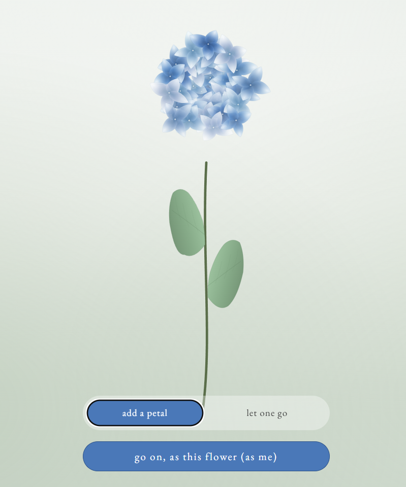
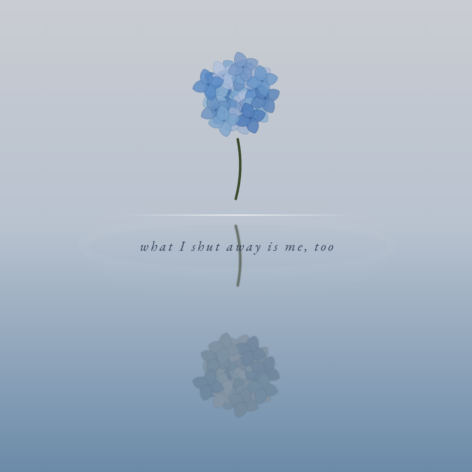
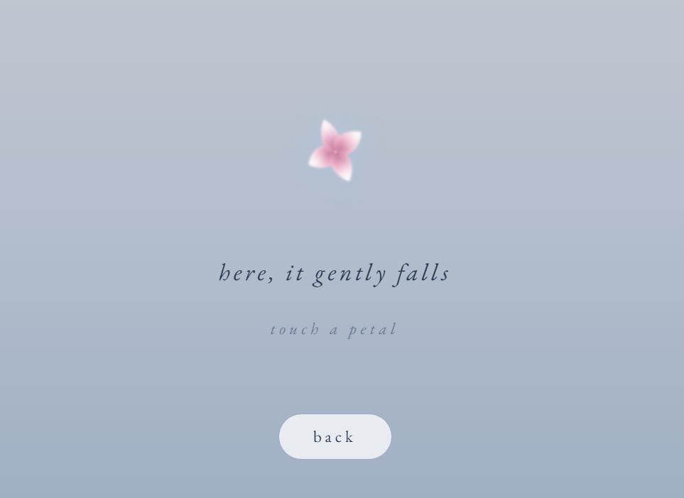

 🪷　Hydrangea Breath

Interact with hydrangeas to release your suppressed emotions. Move lighter, live lighter.**
紫陽花と触れ合い、抑え込んだ感情を解放する。思考と行動を、もっと軽やかに。）

<!-- 画像1 -->

<!-- 画像2 -->

<!-- 画像3 -->

<!-- 画像4 -->

<!-- 画像5 -->

✨ Overview / 概要

Hydrangea is a beautifully minimal, interactive mental wellness web app designed to help you let go of heavy thoughts and release trapped emotions in just 2 minutes. 

「Hydrangea Breath」は、わずか2分間で重い思考を手放し、閉じ込めた感情を解放するために作られた、ミニマルで美しいインタラクティブな感情解放Webアプリです。

 🌸 How it Works / 体験の流れ

1. Personalize Your Canvas (キャンバスのカスタマイズ)
   * When you open the app, you can freely increase or decrease the number of gray hydrangeas to reflect your current mind space.
   * アプリを開くと、現在の心の状態を反映するように、グレーの紫陽花の数を自由に増やしたり減らしたりできます。

2. Confront Your Reflection (水面の自分と向き合う)**
   * The visual represents you—reflecting on the water's surface, carrying the hidden anxieties and emotions you've been suppressing.
   * そのビジュアルはあなた自身。水面に反射し、内に閉じ込め、本当の感情や不安を抑え込んでいる姿を映し出します。

3. **Interactive Liberation (インタラクティブな解放)
   * As you engage with the app and declutter your thoughts, the shadow-like gray petals multiply and bloom, transforming into a vibrant, fresh radiance of light purple, soft pink, and pure white.
   * 画面を進めて思考を整理していくと、影のようだったグレーの花びらが自然に数を増し、殻を破るように、淡い藤色、薄ピンク、白の瑞々しく鮮やかな輝きへと変化していきます。

🌻　Our Vision / 開発の想い

In a noisy world, we often lock away our true feelings and overcomplicate our minds. This product was born from a vision to help people declutter their thoughts and actions, allowing them to live with a lighter heart. 

ノイズの多い世界の中で、私たちはしばしば本当の感情を閉じ込め、思考を複雑にしすぎてしまいます。このプロダクトは、人々が思考と行動を整理し、もっと軽く生きられるようにという願いから生まれました。

 Live Demo

Experience a brief moment of visual healing and profound emotional liberation today:
👉 **[https://water-vessel-310.vercel.app](https://water-vessel-310.vercel.app)**
